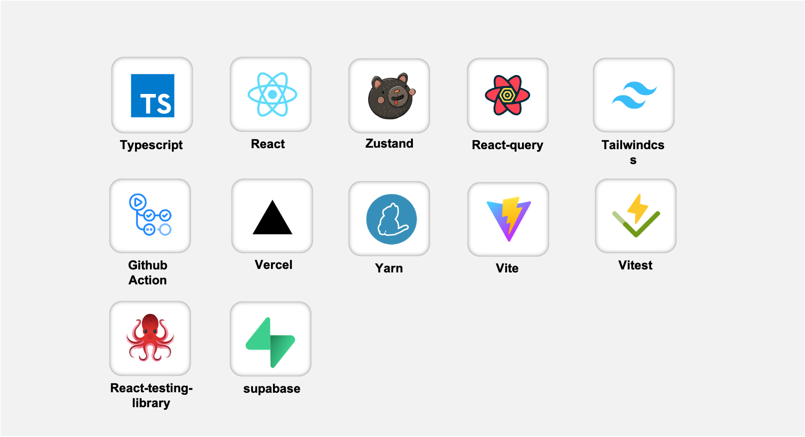
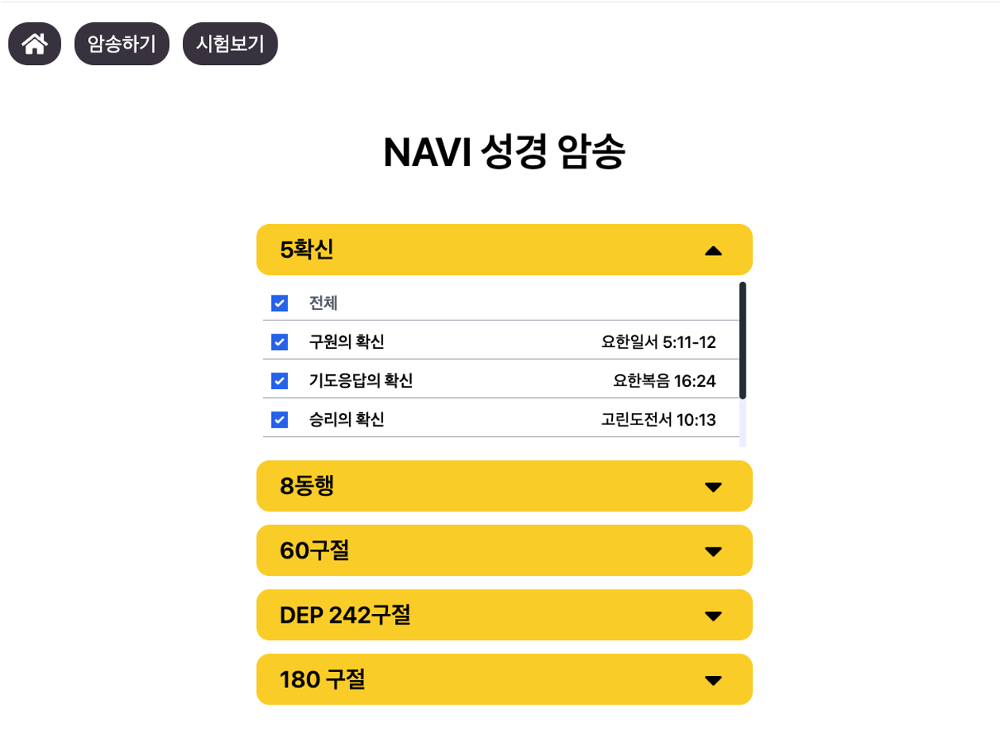
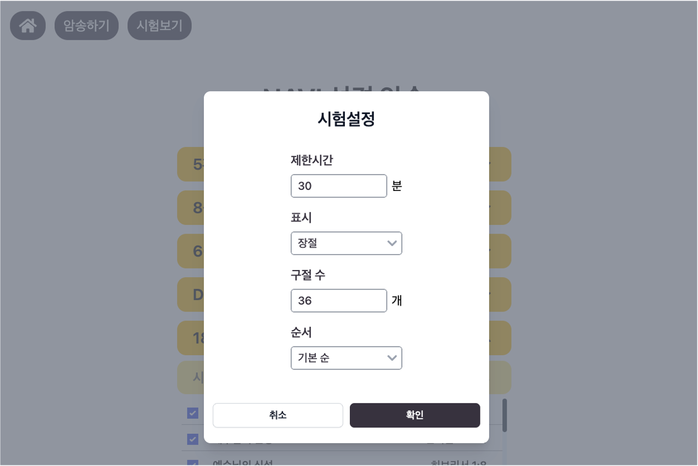
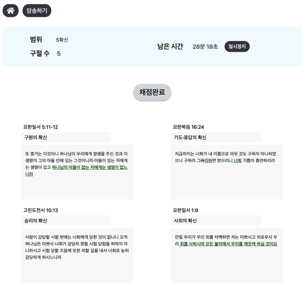
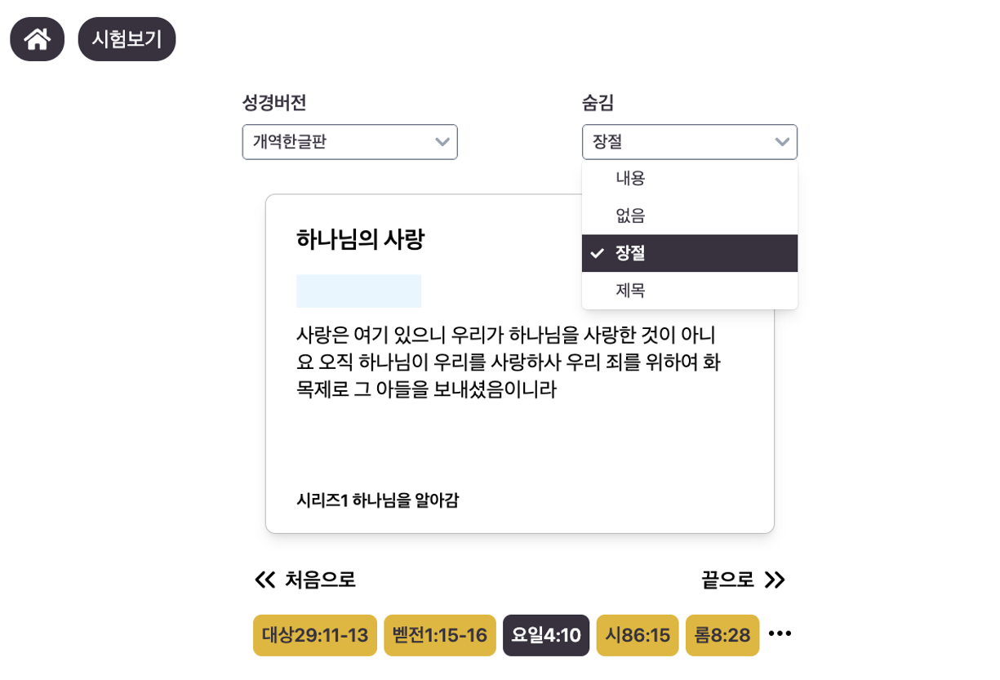

## Contents

- [프로젝트 개요](#프로젝트-개요)
- [사이트 훑어보기](#사이트-훑어보기)

<br/>

## 프로젝트 개요

<br/>


### 소개 

* 성경의 대표 구절 495개를 주제별로 선택해 읽고 외울 수 있는 웹 애플리케이션 입니다.
* 구절의 장절/제목/내용을 가려가며 읽을 수 있고, 필기 테스트를 통해 외운 말씀을 복습할 수 있습니다. </aside>

##### [👉 사이트 방문하기](https://navi-bible-memory.vercel.app)

<br/>

### 멤버

- #### [EUNSUN23](https://github.com/EUNSUN23) (단독개발)

<br/>

### 기술스택



<br/>

### 프로젝트 구조

```
src
├── features     
├── lib         
├── msw         
├── pages        
├── shared       
├── store        
├── supabase    
├── test         
├── types        
├── utils        
├── RootPage.tsx  
├── main.tsx           
├── index.css          
├── vite-env.d.ts     ```
```

* **`features`** : 애플리케이션 핵심 기능
* **`lib`** : 외부 라이브러리와 연계된 유틸리티 소스 - ex) supabase API 응답 핸들러
* **`msw`** : MSW(Mock Service Worker) 설정 및 mock 데이터
* **`shared`** : 프로젝트에 종속되지 않는 재사용 가능한 UI 컴포넌트, 상수, 타입
* **`store`** : Zustand 기반 전역 상태 관리 모듈
* **`supabase`** : Supabase 초기화 및 설정
* **`test`** : 테스트 환경 설정 및 테스트 유틸리티
* **`types`** : 프로젝트 공통 타입
* **`utils`** : 프로젝트 유틸리티 함수
* **`main.tsx`** : 애플리케이션 진입점
* **`vite-env.d.ts`** : Vite 환경 타입 정의

<br/>

### 프로젝트 실행

**`.nvmrc`에 기재된 Node.js 버전 설치**

```bash
nvm install 
nvm use
```

<br/>

**프로젝트 패키지 설치**

```bash
yarn install
```

<br/>

**개발서버 실행**

```
yarn dev
```

<br/>

### 개발 현황

#### Complete

- 성경 말씀 암송 테스트 및 채점 기능
- 테마별 말씀 선택 및 암송 기능

#### Processing

- 테스트 결과 공유기능
- 개인화 기능
  - 계정 생성 & 로그인/로그아웃
  - 개인 구절(OYO) 추가하기


<br/>

## 사이트 훑어보기


<br/>

> ### 테마별 성경말씀 선택



<br/>

> ### 말씀 암송 테스트




<br/>

> ### 말씀 암송



<br/>

